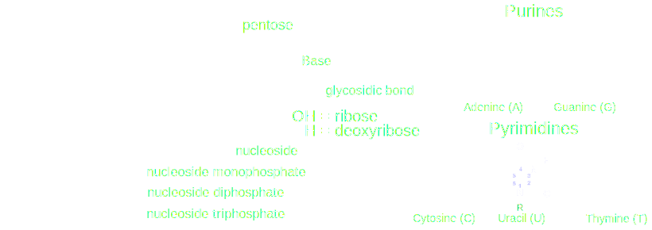
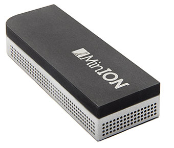
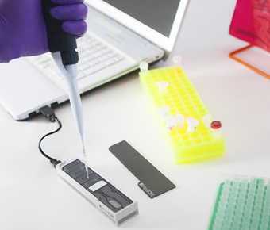

### Towards an advanced & open 
### web platform 
### for bacterial genotyping

#### DjangoCong 2013

<small>September, 28th 2013 - UTMB, Belfort, France</small>  
---

# Outline

1. Introduction to bacterial genotyping.
2. People involved.
3. The past,
4. The present (demo),
5. The future of MicroGeno.

---

# Bacterial
# genotyping

--

### Nucleic acids (DNA & RNA) ...

#### ... could be cast to strings

    >gi|176120924|ref|NC_001417.2| Enterobacterio phage MS2, complete genome
    GGGTGGGACCCCTTTCGGGGTCCTGCTCAACTTCCTGTCGAGCTAATGCCATTTTTAATGTCTTTAGCGA
    GACGCTACCATGGCTATCGCTGTAGGTAGCCGGAATTCCATTCCTAGGAGGTTTGACCTGTGCGAGC...

--

### Tandem Repeat (TR)

> Consecutive sequences of 1 to more than 200 nucleotides, perfectly identical or not.

    ATTGCCAG ATTGCCAG ATCGCCAG ATTGGCAG ATTGC...

* TR are found in all genomes.
* Intragenic & intergenic regions.

--

### Variable Number of Tandem Repeat (VNTR)

#### A polymorphic TR is called VNTR

> [...] variations in the repeat number contribute to adaption to environmental changes, through protein function [...] or through regulation of gene expression

--

### Multiple Loci VNTR Analysis (MLVA)

* Genotyping method
* Intra-species comparison of strains
* Analysis of several (multiple) VNTRs dispersed on the genome
* Deduce the strain code corresponding to the number of repeats at each VNTR

e.g. for VNTRs A - B - C:

> Strain_01 : <strong>7 - 10 - 4</strong> // Strain_02 : <strong>8 - 4 - 7</strong>

--

### Why do we need bacterial genotyping?

* To compare large numbers of strains isolated from clinical and environmental sources
* To perform outbreak investigations
* To study bacterial population structure and emergence of clones
* To invest the origin of a biological sample (biodefense, forensics)

---

# The people

--

### G. Vergnaud, PhD

* Scientific head of MicroGeno
* Searching for a lead developer
* MLVABank code refactoring

-- 

## ComSource 
### { TailorDev }

* Web & print agency
* <strong>Toulouse</strong> & <strong>Clermont-Ferrand</strong>, France
* <a href="http://julien.maupetit.me" target="_blank">Julien Maupetit</a>, PhD, Co-Founder (CTO)
* Strong background in <strong>bio-informatics</strong>

---

# The past

--

## MLVABank

* From 2007 to 2013
* Originally developed & maintained by Paris Sud
* PHP & JavaScript, no framework

--

### MLVABank features

* User-friendly
* Cooperative databases
* Contributors keep control of their data
* MLVA data, but not only...

---

# The present

--

* MicroGeno is the new MLVABank
* Development started in 2012
* Completely rewrote from scratch
* <strong>Python</strong> - <strong>Django</strong> web framework
* Twitter <strong>Bootstrap</strong>

--

## MicroGeno core features

* Logical data storage (relational database schema)
* *in situ* clusters analysis (dendrogram, MST)
* Not dedicated to a particular species
* Supports MLVA, MLST, SNP, SPOLIGO and CRISPR data
* Cloud-ready (SaaS & PaaS)

--

## Demo party!

---

# The future

--

## Ongoing directions (1)

* Open Source
* Docs, docs, docs (developers and end-users)
* Tests, tests, tests (TDD)
* Move front-end to a JS framework such as [AngularJS](http://angularjs.org)

--

## Ongoing directions (2)

* REST API
* Local analysis tools
* Synchronize (selected) data to the/your cloud

--

## Ongoing directions (3)

### MicroGeno Chip

---

## Thank you!

### Availability

This presentation is available at [https://github.com/ComSource/](https://github.com/ComSource/)

<h3>Icons credit</h3>

<a href="http://thenounproject.com/noun/cassette/#icon-No911" target="_blank">Cassette</a> designed by <a href="http://thenounproject.com/pavel.andreev" target="_blank">Pavel Andreev</a> from The Noun Project 

<a href="http://thenounproject.com/noun/cloud-download/#icon-No2786" target="_blank">Cloud Download</a> designed by <a href="http://thenounproject.com/somerandomdude" target="_blank">P.J. Onori</a> from The Noun Project 

<a href="http://thenounproject.com/noun/rocket/#icon-No7427" target="_blank">Rocket</a> designed by <a href="http://thenounproject.com/cabaroc" target="_blank">Jean-Philippe Cabaroc</a> from The Noun Project 

VNTR figure: <a href="http://en.wikipedia.org/wiki/File:VNTRDemo.gif#file" target="_blank">wikipedia</a>

    

        This work is licensed under a Creative Commons Attribution-NonCommercial-NoDerivs 3.0 Unported License.
    

        

